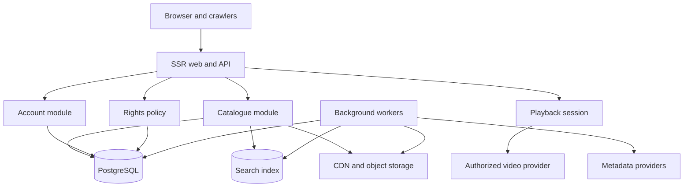

# FreeStream Production Architecture

## Decision summary

FreeStream should use a modular monolith first. The browser-facing application, API procedures, rights policy, ingestion workflows, and admin capabilities remain in one deployable codebase with strict module boundaries. Background jobs and media processing run as separately scalable workers only when their workload requires it.

The current WebDev implementation is a visual prototype. It uses React, Tailwind, tRPC, Manus OAuth, and a MySQL-compatible database scaffold. Production work must replace fixture content with provider-backed records and must not expose playback controls until rights validation succeeds.

## Proposed stack

| Concern          | Production choice                                                   | Reason                                                        |
| ---------------- | ------------------------------------------------------------------- | ------------------------------------------------------------- |
| Web application  | Next.js or equivalent SSR-capable React runtime                     | Crawlable movie pages and low client JavaScript               |
| API              | TypeScript procedures behind a versioned API boundary               | Typed contracts and modular authorization                     |
| Primary database | PostgreSQL with Prisma or Drizzle                                   | Relational integrity, indexing, and auditability              |
| Search           | Meilisearch initially; OpenSearch if scale or analytics requires it | Typo tolerance and faceted search                             |
| Cache            | Redis-compatible service                                            | Sessions, rate limits, hot catalogue responses, queues        |
| Media storage    | S3-compatible object storage                                        | Durable source and derivative storage                         |
| Media delivery   | CDN with signed URLs                                                | Efficient delivery without proxying video through the app     |
| Video            | Managed video provider or FFmpeg worker pipeline                    | HLS/DASH packaging, thumbnails, captions, DRM integration     |
| Auth             | Managed OAuth plus verified email identity                          | Secure session lifecycle and lower credential risk            |
| Observability    | Structured logs, metrics, traces, error tracking                    | Playback, ingestion, and rights operations require visibility |

## Boundaries

```text
Browser / crawlers
        |
SSR web + API gateway
        |
+-------+----------+-------------+-------------+
|       |          |             |             |
Catalog Search  Rights       Accounts       Admin
|       |          |             |             |
+-------+----------+-------------+-------------+
        |
PostgreSQL  Redis  Object storage / CDN  Job queue
        |
Metadata providers | Video providers | Email | Analytics
```

Metadata, media, and rights are separate domains. A movie row describes a work. A media asset describes a file or derivative. A playback source describes a provider endpoint. A rights grant determines whether that source may be exposed for a viewer, territory, platform, and date.

## Runtime flows

A public movie request loads canonical metadata server-side, resolves availability without revealing temporary playback URLs, and emits structured metadata. A play request creates a short-lived playback session after the rights policy confirms territory, dates, platform, account state, and provider restrictions. The application returns only the provider-specific signed access token or URL.

Ingestion is idempotent: fetch, validate, normalize, deduplicate, preserve provenance, persist, index, process artwork, and publish only after required metadata and rights checks pass. Video processing is asynchronous and never blocks catalogue browsing.

## Decisions still required

The team must choose the initial metadata provider, the managed video provider, the primary territories, monetization model, identity provider policy, and whether creator uploads are in MVP. These choices affect contracts, storage, moderation, and compliance.

## References

[1]: https://nextjs.org/docs "Next.js Documentation"
[2]: https://www.postgresql.org/docs/ "PostgreSQL Documentation"
[3]: https://www.w3.org/TR/media-source/ "W3C Media Source Extensions"
[4]: https://www.rfc-editor.org/rfc/rfc7519 "RFC 7519 JSON Web Token"

## Architecture diagram



## Audit remediation: portability and scale

### Provider-neutral playback

The domain model must not store provider-specific assumptions in `Movie`, `RightsGrant`, or the public API. Each playback adapter declares capabilities such as HLS, DASH, DRM systems, caption formats, audio tracks, token binding, revocation, and webhook support. A capability matrix is evaluated before a title is published. Provider IDs and manifests remain adapter data behind a stable `PlaybackSource` contract.

Playback provider migration uses dual-read or shadow validation in staging, followed by per-title cutover. New sessions use the selected source while existing sessions honor the original session contract. The system must support at least two approved provider adapters before production claims provider independence.

### CDN and origin rules

Artwork and public derivatives use immutable content hashes in their URLs. CDN cache keys exclude cookies and irrelevant query parameters. Private originals, manifests, caption files, and segments use signed access and origin protection. The CDN uses an origin shield, bounded TTLs for mutable availability metadata, purge-by-version rather than purge-by-wildcard, and egress monitoring by title and provider.

### Work queues and backpressure

Every long-running workflow has an idempotency key, retry policy, dead-letter queue, maximum attempts, timeout, and operator replay action. Media processing and metadata ingestion are separate queues. Queue depth, age of oldest job, and provider rate-limit responses are monitored. Workers apply bounded concurrency so one provider or title cannot exhaust the system.

### Scale triggers

The first scale trigger is measured load, not a premature microservice split. Split a module only when its CPU, memory, queue, database contention, or deployment cadence is independently constrained. Read replicas, search sharding, database partitioning, and regional media delivery are preferred before adding more application services.
