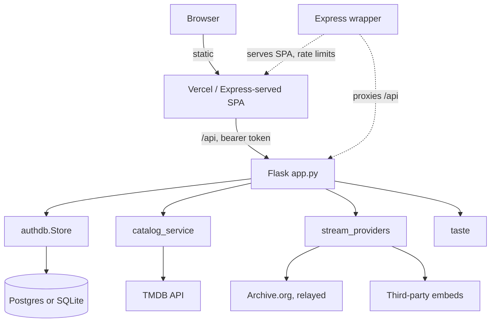

# Stream Vy Architecture

## What is actually running

Three processes, in this order:

```text
Browser
  |
  |  static assets
  v
Vite SPA  (client/, React 19 + Wouter + Tailwind 4)
  |                                    |
  |  same-origin /api in dev           |  cross-origin /api in production
  v                                    v
Express wrapper  --proxy /api-->  Flask backend  (movie-backend/app.py)
server/_core/index.ts                    |
  |                                      +--> authdb.Store  (Postgres or SQLite)
  |                                      +--> catalog_service / tmdb_service
  |                                      +--> stream_providers
  |                                      +--> taste
  v
Archive.org (relayed) | third-party embed iframes | TMDB
```

The Express wrapper is not scaffolding and should not be deleted. It serves the
built SPA in production, attaches Vite middleware in development, proxies `/api`
to Flask, and applies the request rate limiting. The client never talks to Flask
directly in dev — Vite's proxy keeps every request same-origin.

## Frontend

- React 19 SPA, client-side routing with Wouter. No SSR.
- Requests go through the typed services in `client/src/services/*`, which
  resolve a base URL from `VITE_MOVIE_API_BASE_URL` and attach the bearer token.
- Context providers in `client/src/main.tsx`: `LocalSessionProvider` (offline
  demo), `AuthProvider` (real account), `ActiveProfileProvider` (household
  profile).
- **There is no tRPC client and no react-query cache.** The template shipped one
  pointed at `/api/trpc`; nothing in the product used it, and because the `/api`
  proxy goes to Flask — which serves no `/api/trpc` route — every call through it
  404'd. It was removed rather than left as a dependency with no caller.
- `vite.config.ts` is at the repository root. It defines the `@` alias, proxies
  `/api` to `http://localhost:5000`, writes the SPA to `dist/public`, and bundles
  the server to `dist/index.js` via esbuild.

## Backend

One Flask app, no blueprints, 46 route rules in `movie-backend/app.py`. It is the
single source of truth for the provider chain: `stream_providers.resolve()`
walks an ordered manifest of a direct (Archive.org) tier and an embed tier,
consults a per-provider health record with cooldowns, and returns the first
playable source plus the remaining candidates for client-side failover. A
request only fails once every enabled provider has been attempted.

Before this module existed, two disjoint provider lists lived in `app.py` and
`client/src/lib/embedSources.ts` and failover was decided in the browser, one
click at a time. That is why the client no longer has a "Try another source"
button as its primary path.

`catalog_service` re-fetches live titles on every catalogue request, normalizes
them into one `MediaItem` contract, and persists them write-through to
`media_items`. That table doubles as the fallback when every upstream call fails.
There is deliberately no nightly seeder: the catalogue is driven by real traffic.

## Storage

`authdb.Store` picks a backend at construction:

| Condition                | Backend                                   |
| ------------------------ | ----------------------------------------- |
| `DATABASE_URL` is set    | PostgreSQL via `psycopg` (Neon in practice) |
| `DATABASE_URL` is unset  | SQLite file at `movie-backend/data/`      |

There is no ORM, no migration framework, and no Neon-specific code path. Schema
changes are `CREATE TABLE IF NOT EXISTS` statements in the store modules, so
adding a column means editing the DDL and testing it. That is a real limitation,
not a design choice: see [data model](data-model.md).

## Data flow: what happens when a viewer presses play

1. The client asks `/api/movies/resolve` with a title, TMDB id, and media type.
2. The server resolves a record and asks `stream_providers.resolve()`.
3. A direct catalog hit returns an Archive.org source. The player plays it
   through `/api/movies/stream`, which relays the bytes so range requests and
   seeking work. `/api/movies/download` is the explicit download path.
4. No direct hit means an ordered list of embed candidates. The client renders
   the first in an iframe and labels the state as an embed, not as native
   playback.
5. Every path through this decrements the daily allowance server-side.

## Why there is no search engine, cache, or queue

At a household-and-hundreds-of-titles scale, PostgreSQL indexing and an in-process
SQLite catalog answer search faster than Meilisearch does, and there is no
long-running job that would justify a queue or Redis. The previous
documentation specified all three. They were removed as noise, not deferred:
if measured load ever justifies them, [roadmap](roadmap.md) says so.

## Deployment split

The SPA is deployed to Vercel (`vercel.json`, `vite build`, output
`dist/public`, all routes rewritten to `index.html`). The Flask backend is a
separate Gunicorn service, in practice on Render. Because Vercel hosts no API of
its own, production browser requests are cross-origin to Flask, which is why
`ALLOWED_ORIGINS` exists. See [deployment](deployment.md) and
[environment](environment.md).

## Diagram


```mermaid
flowchart TD
  B[Browser] -->|static| V[Vercel / Express-served SPA]
  V -->|"/api, bearer token"| F[Flask app.py]
  F --> S[authdb.Store]
  F --> C[catalog_service]
  F --> P[stream_providers]
  F --> T[taste]
  S --> DB[(Postgres or SQLite)]
  C --> TMDB[TMDB API]
  P --> AR[Archive.org, relayed]
  P --> EM[Third-party embeds]
  X[Express wrapper] -. proxies /api .-> F
  X -. serves SPA, rate limits .-> V
```
