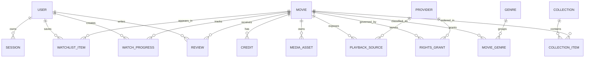

# Lenflix Data Model

## Core entities

| Entity | Key fields | Important constraints |
|---|---|---|
| User | id, email, role, preferences | Unique normalized email; role changes audited |
| Session | id, userId, tokenHash, expiresAt | Store hash, rotate and revoke |
| Movie | id, slug, titles, synopsis, releaseDate, status | Unique canonical slug; published requires validation |
| Genre | id, slug, name | Unique slug |
| MovieGenre | movieId, genreId | Composite unique key |
| Person | id, name, slug | Unique slug |
| Credit | movieId, personId, role, character | Indexed by movie and person |
| MediaAsset | id, movieId, kind, storageKey, processingStatus | Storage key is not public access |
| PlaybackSource | id, movieId, providerId, manifestRef, status | Source cannot be playable without rights |
| RightsGrant | id, movieId, providerId, territory, startsAt, endsAt, status | Indexed by movie, territory, dates |
| WatchlistItem | userId, movieId, createdAt | Composite unique key |
| WatchProgress | userId, movieId, positionMs, durationMs | One current row per user/movie |
| Rating | userId, movieId, value | Composite unique key and range validation |
| Review | id, userId, movieId, body, status, spoiler | Moderation status required |
| Collection | id, slug, title, status, schedule | Published collection requires items |
| CollectionItem | collectionId, movieId, position | Composite unique key |
| Submission | id, creatorId, status, rightsDeclaration | State transitions audited |
| Notification | id, userId, type, readAt | Retention policy required |
| AuditLog | id, actorId, action, entity, before, after | Append-only and access restricted |
| Provider | id, kind, configRef, status | Secrets stored outside rows |
| IngestionJob | id, providerId, status, cursor, metrics | Idempotency key and retries |
| SearchIndexState | movieId, indexVersion, indexedAt, status | Reconciliation with search engine |
| AdBlockRule | id, ruleType, pattern, action, version, enabled | Safe default and allowlist precedence |

## Provenance

Provider-backed fields store provider name, external ID, import timestamp, last synchronization timestamp, source version when available, and whether an administrator has overridden the field. Synchronization must not overwrite approved human edits without an explicit conflict policy.

## Publication invariant

A movie can be published only when required metadata, artwork, media readiness, rights status, and moderation checks pass. A playback source can be exposed only when a rights grant is active for the request context.

## Indexing

Indexes should cover movie status and slug, release date, title search support, rights lookup by movie and territory/date, watchlist by user, progress by user, reviews by movie/status, ingestion status, and audit events by entity and created time.

## Relationship diagram

