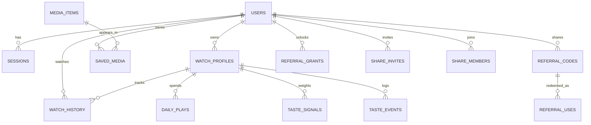

# Stream Vy Data Model

There is no ORM and no migration framework. Schema lives as
`CREATE TABLE IF NOT EXISTS` DDL inside the store modules, duplicated for
PostgreSQL and SQLite because their type systems differ. **Adding a column means
editing DDL in both dialects and testing both paths** — see
[roadmap](roadmap.md).

Entities described in earlier versions of this document that do not exist:
`Movie`, `Genre`, `MovieGenre`, `Person`, `Credit`, `MediaAsset`,
`PlaybackSource`, `RightsGrant`, `Rating`, `Review`, `Collection`,
`CollectionItem`, `Submission`, `Notification`, `AuditLog`, `Provider`,
`IngestionJob`, `SearchIndexState`, and `AdBlockRule`.

## Account and household tables

`authdb` — `users`, `sessions`, `watch_profiles`, `watch_history`,
`daily_plays`, `saved_media`, `referral_codes`, `referral_uses`,
`referral_grants`, `taste_signals`, `taste_events`, `share_invites`,
`share_members`, `catalog_cache`.

| Table             | Key columns                                                                   | Constraints                                                        |
| ----------------- | ----------------------------------------------------------------------------- | ------------------------------------------------------------------ |
| `users`           | `id` UUID, `email` UNIQUE, `display_name`, `password_hash`, `created_at`      | Unique normalized email; PBKDF2-HMAC-SHA256, per-user random salt  |
| `sessions`        | `token` PK, `user_id` FK, `expires_at`                                        | 30-day expiry; cascade on user delete                              |
| `watch_profiles`  | `id`, `user_id`, `name`, `avatar`, `avatar_id`, `is_kids`, `is_locked`, `pin_hash`, `pin_salt`, `sort_order` | Max 4 per account; PIN is write-only, never returned |
| `watch_history`   | `user_id`, `profile_id`, `movie_key`, `progress_seconds`, `duration_seconds`, `completed`, `watched_at` | `UNIQUE (user_id, profile_id, movie_key)` |
| `daily_plays`     | `profile_id`, `day`, `movie_key`, `played_at`                                 | `PRIMARY KEY (profile_id, day, movie_key)` — the allowance ledger  |
| `saved_media`     | `user_id`, `media_id`, `media_type`, `title`, `poster_path`                   | `UNIQUE (user_id, media_id)`                                       |
| `catalog_cache`   | `media_id` PK, `media_type`, `payload`, `updated_at`                          | Index on `(media_type, updated_at DESC)`; JSONB on Postgres        |

`sessions` is keyed by the raw bearer token rather than a hash. It is an opaque
random value stored server-side, but storing a hash would be strictly better and
is listed in [security](security.md).

### Referral tables

`referral_codes` holds one shareable `code` per owner. `referral_uses` has
`UNIQUE (code_id)` and `UNIQUE (referred_id)`, which makes self-referral and
double-claiming impossible **at the database level** rather than in application
logic. `referral_grants` is a separate table for unlocked days so a grant is
auditable and revocable, and so the daily cap can be recomputed from scratch
instead of mutating a counter that can drift.

### Taste tables

`taste_signals` holds rolled-up `UNIQUE (profile_id, kind, feature)` weights.
`taste_events` is the append-only interaction log the recommender is scored from
and the held-out evaluation is split on, indexed on
`(profile_id, created_at DESC)`.

**Only derived features persist.** A search is reduced to normalised
genre/cast/director tokens plus a hashed query token; the raw text is never
stored, so a private search cannot be reconstructed from these tables.

### Sharing tables

`share_invites` is an outstanding invitation: unique `token`, `owner_id`, optional
`email`, `role` (default `viewer`), `status` (default `pending`), a 7-day
`expires_at`, and `accepted_by` (`ON DELETE SET NULL`). `share_members` is one
row per accepted participant, `UNIQUE (owner_id, user_id)`.

A share grants **read access to the owner's `saved_media`**; nothing is copied.
Member removal and revoke are owner-only and checked server-side.

## Catalogue cache

`catalog_store.py` — `media_items`, a SQLite table used as a write-through cache
and upstream-outage fallback:

| Column                                                      | Purpose                              |
| ------------------------------------------------------------ | ------------------------------------ |
| `provider_id` PK                                             | Stable `"{type}:{id}"` key           |
| `title`, `media_type`, `year`, `overview`                     | Display and identity                 |
| `poster_url`, `backdrop_url`                                  | Artwork                              |
| `vote_average`, `popularity`                                  | TMDB-provided, not user ratings      |
| `genres`, `genres_key`                                        | JSON list and a filterable key       |
| `runtime`, `director`, `cast`, `country`, `language`, `release_date` | Metadata                       |
| `imdb_id`, `tmdb_id`                                         | External IDs                         |
| `source`, `created_at`, `updated_at`                          | Provenance and freshness             |

Indexes: `(media_type, year DESC)`, `(popularity DESC)`, `(genres_key)`.

Note the split: **the cache is SQLite even when the account store is Postgres.**
A Postgres deployment therefore has two stores. That is a real consequence of the
`CatalogStore` design, not an oversight.

## Provenance

`media_items.source` records which provider produced a record, and `updated_at`
records freshness. There is no field-level provenance, no administrator override
flag, and no conflict queue. A field changed upstream overwrites the cached
value. The previous documentation described a reconciliation system; it does not
exist.

## Deletion

`DELETE /api/auth/account` deletes explicitly, in order: profiles, history,
daily plays, taste, saved media, shares, invitations, members, referral uses and
codes, grants, sessions, then the user. The explicit list exists because
`catalog_cache` and `media_items` have no user key, and because the share and
referral rows reference users from both directions (`accepted_by`,
`referred_id`) in ways a cascade would get wrong.

## Diagram

```mermaid
erDiagram
  USERS ||--o{ SESSIONS : has
  USERS ||--o{ WATCH_PROFILES : owns
  USERS ||--o{ SAVED_MEDIA : saves
  USERS ||--o{ WATCH_HISTORY : watches
  USERS ||--o{ REFERRAL_CODES : shares
  USERS ||--o{ REFERRAL_GRANTS : unlocks
  USERS ||--o{ SHARE_INVITES : invites
  USERS ||--o{ SHARE_MEMBERS : joins
  WATCH_PROFILES ||--o{ WATCH_HISTORY : tracks
  WATCH_PROFILES ||--o{ DAILY_PLAYS : spends
  WATCH_PROFILES ||--o{ TASTE_SIGNALS : weights
  WATCH_PROFILES ||--o{ TASTE_EVENTS : logs
  REFERRAL_CODES ||--o{ REFERRAL_USES : redeemed_as
  MEDIA_ITEMS ||--o{ SAVED_MEDIA : appears_in
```

## Gaps

- No migration tooling, so schema change is a manual, dialect-duplicated edit.
- Two storage backends in one deployment (Postgres accounts, SQLite catalogue).
- No indexes on `sessions.expires_at` or `watch_history.user_id` alone; current
  access patterns are all covered by the composite keys.
- No foreign key from `watch_history.movie_key` or `saved_media.media_id` to a
  media table, so catalogue rows can disappear from under a saved entry. History
  and list deliberately store their own title, year, and poster for that reason.
- No audit log, notification, moderation, or review tables.
